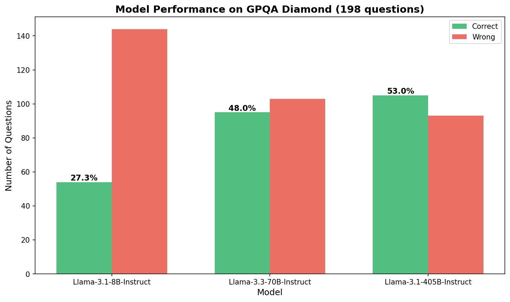
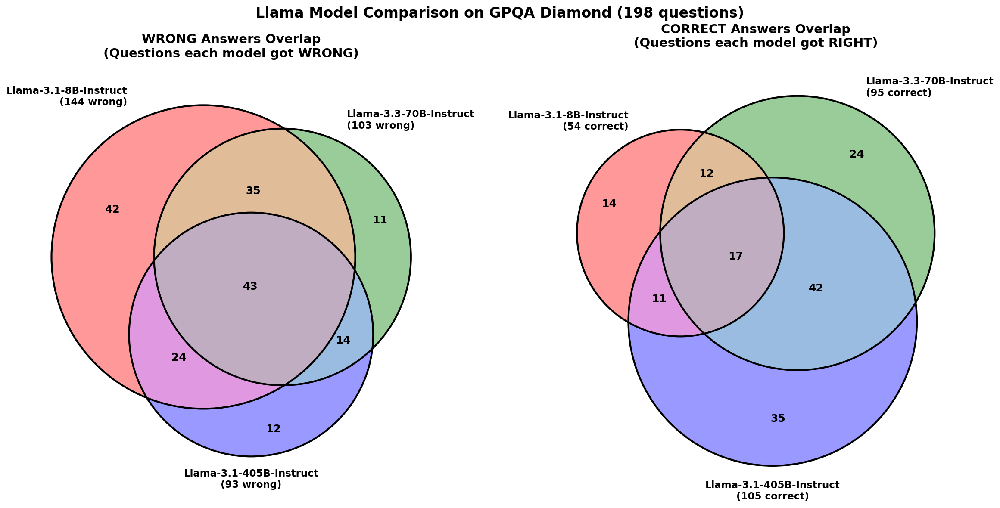
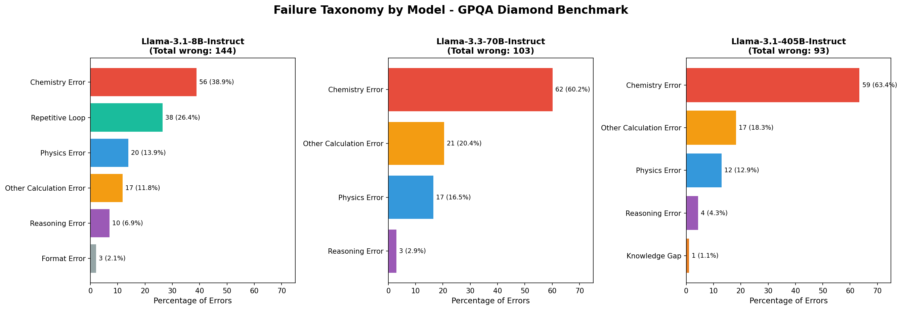
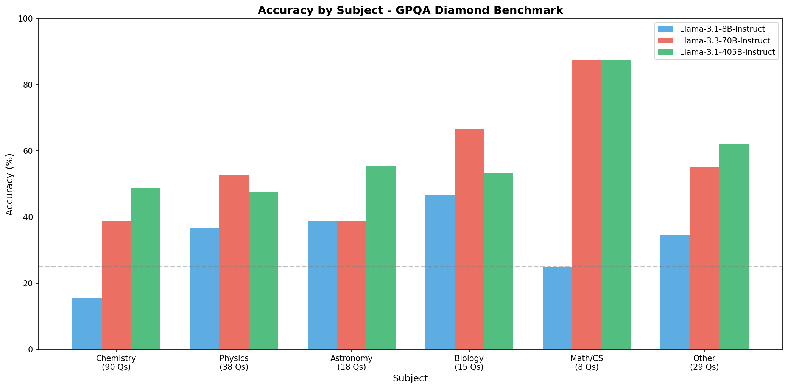

# NeMo Evaluator Demo: GPQA Diamond Benchmark

This repository demonstrates NVIDIA NeMo Evaluator for comparing Llama models on the GPQA Diamond benchmark (198 graduate-level science questions).

## Results Summary

| Model | Accuracy | Extraction Failures |
|-------|----------|---------------------|
| **Llama-3.1-8B-Instruct** | 27.3% (54/198) | 20.7% (41) |
| **Llama-3.3-70B-Instruct** | 48.0% (95/198) | 0% |
| **Llama-3.1-405B-Instruct** | 53.0% (105/198) | 0% |

## Repository Structure

```
.
├── configs/                    # Evaluation configurations
│   ├── llama-8b.yaml
│   ├── llama-70b.yaml
│   └── llama-405b.yaml
├── clean_results/              # Final evaluation results (HTML reports)
│   ├── Llama-3.1-8B-Instruct/
│   ├── Llama-3.3-70B-Instruct/
│   └── Llama-3.1-405B-Instruct/
├── analysis/                   # Analysis scripts and outputs
│   ├── ANALYSIS_REPORT.md      # Detailed analysis report
│   ├── model_accuracy.png      # Accuracy comparison plot
│   ├── failure_taxonomy_plot.png
│   ├── accuracy_by_subject.png
│   └── venn_analysis.png
└── README.md
```

## Key Findings

### 1. Scaling Improves Accuracy
- 8B → 70B: +20.7% accuracy improvement
- 70B → 405B: +5% accuracy improvement

### 2. Failure Taxonomy

**Llama-3.1-8B-Instruct** has unique generation quality issues:
- 26.4% of errors are **repetitive loops** (model gets stuck)
- Only affects the smallest model

**All models struggle with Chemistry**:
- 8B: 39% of errors are chemistry-related
- 70B: 60% of errors are chemistry-related
- 405B: 63% of errors are chemistry-related

### 3. Model Overlap Analysis

- **43 questions** that ALL models got wrong (hardest questions)
- **17 questions** that ALL models got right (easiest)
- **14 questions** where 8B beat both 70B and 405B (regressions)

## Running the Evaluation

### Prerequisites
- NVIDIA NGC API key
- HuggingFace token
- Python 3.10+ with `nemo-evaluator-launcher`

### Setup
```bash
# Create .env file
echo "NGC_API_KEY=your_key" > .env
echo "HF_TOKEN=your_token" >> .env

# Install dependencies
pip install nemo-evaluator-launcher
```

### Run Evaluation
```bash
source .env
nemo-evaluator-launcher run --config configs/llama-8b.yaml
nemo-evaluator-launcher run --config configs/llama-70b.yaml
nemo-evaluator-launcher run --config configs/llama-405b.yaml
```

## Analysis Visualizations

### Model Accuracy Comparison


### Wrong/Correct Answer Overlap (Venn Diagrams)


### Failure Taxonomy by Model


### Accuracy by Subject


## Configuration

Each model config specifies:
- `max_new_tokens: 16384` - Sufficient for complex reasoning
- `temperature: 0.6` - Balanced creativity/consistency
- `parallelism: 3-4` - Concurrent API requests
- `request_timeout: 600` - 10 min timeout for slow responses

## License

This demo uses the NVIDIA NeMo Evaluator and Llama models via the NVIDIA Build API.
